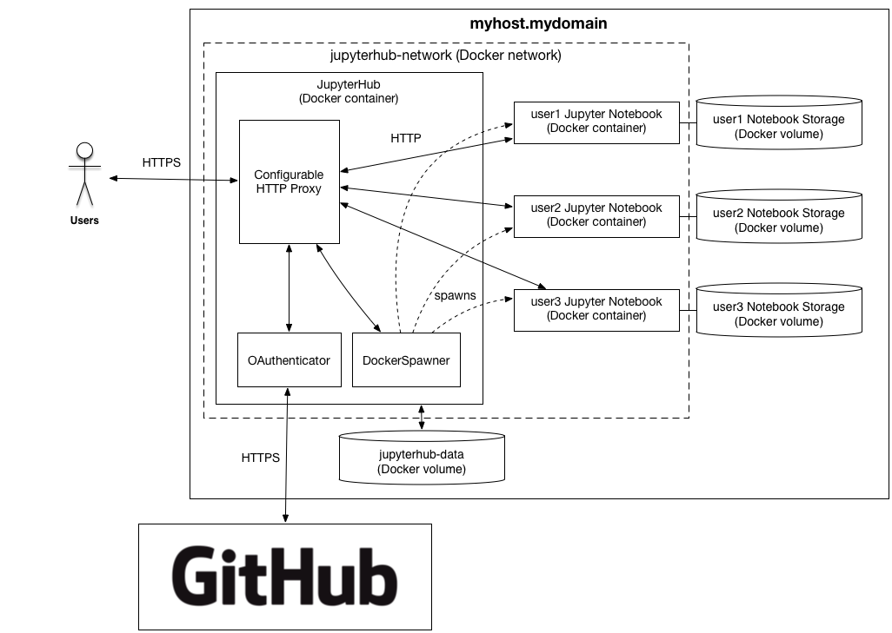
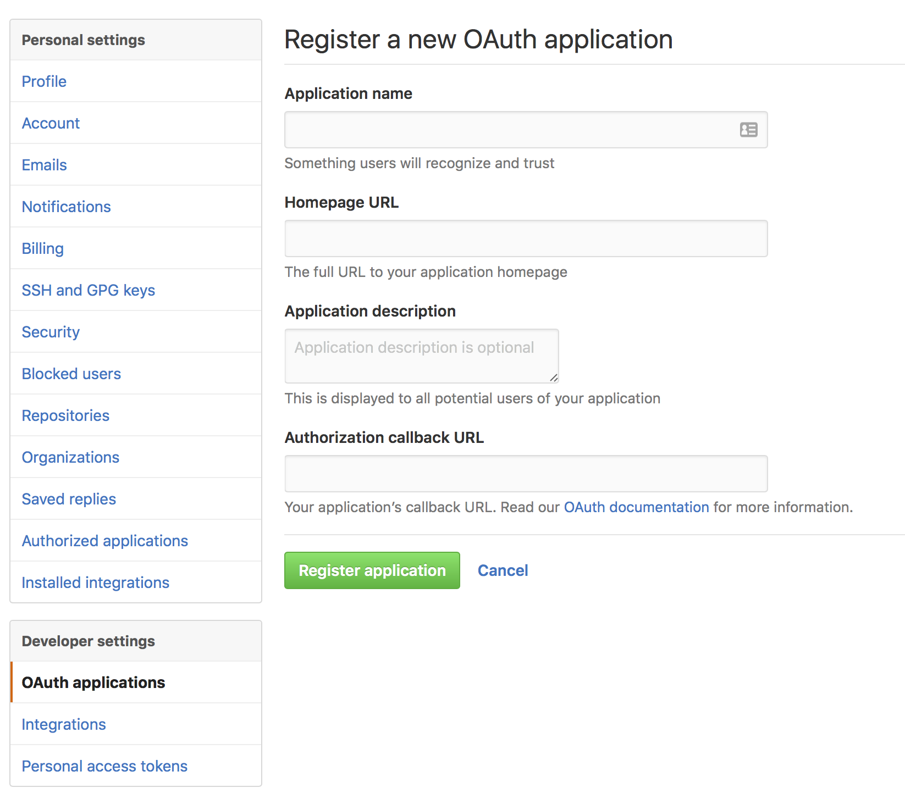

**[Technical Overview](#technical-overview)** |
**[Prerequisites](#prerequisites)** |
**[Authenticator setup](#authenticator-setup)** |
**[Build the JupyterHub Docker image](#build-the-jupyterhub-docker-image)** |
**[Spawner: Prepare the Jupyter Notebook Image](#spawner-prepare-the-jupyter-notebook-image)** |
**[Run JupyterHub](#run-jupyterhub)** |
**[Behind the scenes](#behind-the-scenes)** |
**[FAQ](#faq)**

# jupyterhub-deploy-docker

**jupyterhub-deploy-docker** provides a reference
deployment of [JupyterHub](https://github.com/jupyter/jupyterhub), a
multi-user [Jupyter Notebook](http://jupyter.org/) environment, on a
**single host** using [Docker](https://docs.docker.com).  

Possible **use cases** include:

* Creating a JupyterHub demo environment that you can spin up relatively
  quickly.
* Providing a multi-user Jupyter Notebook environment for small classes,
  teams, or departments.

## Disclaimer

This deployment is **NOT** intended for a production environment. 
It is a reference implementation that does not meet traditional 
requirements in terms of availability nor scalability. 

If you are looking for a more robust solution to host JupyterHub, or
you require scaling beyond a single host, please check out the
excellent [zero-to-jupyterhub-k8s](https://github.com/jupyterhub/zero-to-jupyterhub-k8s)
project.


## Technical Overview

Key components of this reference deployment are:

* **Host**: Runs the [JupyterHub components](https://jupyterhub.readthedocs.org/en/latest/getting-started.html#overview)
  in a Docker container on the host.

* **Authenticator**: Uses [OAuthenticator](https://github.com/jupyter/oauthenticator)
  and [GitHub OAuth](https://developer.github.com/v3/oauth/) to
  authenticate users.

* **Spawner**:Uses [DockerSpawner](https://github.com/jupyter/dockerspawner)
  to spawn single-user Jupyter Notebook servers in separate Docker
  containers on the same host.

* **Persistence of Hub data**: Persists JupyterHub data in a Docker
  volume on the host.

* **Persistence of user notebook directories**: Persists user notebook
  directories in Docker volumes on the host.




## Prerequisites

### Docker

This deployment uses Docker, via [Docker Compose](https://docs.docker.com/compose/overview/), for all the things.
[Docker Engine](https://docs.docker.com/engine) 1.12.0 or higher is
required.

1. Use [Docker's installation instructions](https://docs.docker.com/engine/installation/)
   to set up Docker for your environment.

2. To verify your docker installation, whether running docker as a local
   installation or using [docker-machine](./docs/docker-machine.md),
   enter these commands:

   ```bash
   docker version
   docker ps
   ```

### HTTPS and SSL/TLS certificate

This deployment configures JupyterHub to use HTTPS. You must provide a
certificate and key file in the JupyterHub configuration. To configure:

1. Obtain the domain name that you wish to use for JupyterHub, for
   example, `myfavoritesite.com` or `jupiterplanet.org`.

1. If you do not have an existing certificate and key, you can:

   - obtain one from [Let's Encrypt](https://letsencrypt.org) using
     the [certbot](https://certbot.eff.org) client,
   - use the helper script in this repo's [letsencrypt example](examples/letsencrypt/README.md), or
   - [create a self-signed certificate](https://jupyter-notebook.readthedocs.org/en/latest/public_server.html#using-ssl-for-encrypted-communication).

1. Copy the certificate and key files to a
   directory named `secrets` in this repository's root directory.  These will be
   added to the JupyterHub Docker image at build time. For example, create a
   `secrets` directory in the root of this repo and copy the certificate and
   key files (`jupyterhub.crt` and `jupyterhub.key`) to this directory:

   ```bash
   mkdir -p secrets
   cp jupyterhub.crt jupyterhub.key secrets/
   ```


## Authenticator setup

This deployment uses GitHub OAuth to authenticate users.

It requires that you create and register a [GitHub OAuth application](https://github.com/settings/applications/new)
by filling out a form on the GitHub site:



In this form, you will specify the OAuth application's callback URL in
this format: `https://<myhost.mydomain>/hub/oauth_callback`.

After you submit the GitHub form, GitHub registers your OAuth application and
assigns a unique Client ID and Client Secret. The Client Secret should be
kept private.

At JupyterHub's runtime, you must pass the GitHub OAuth Client ID, Client
Secret and OAuth callback url. You can do this by either:

- setting the `GITHUB_CLIENT_ID`, `GITHUB_CLIENT_SECRET`, and
  `OAUTH_CALLBACK_URL` environment variables when you run the
  JupyterHub container, or
- add them to an `oauth.env` file in the `secrets` directory of this repository.
  You may need to create both the `secrets` directory and the `oauth.env` file.
  For example, add the following lines in the `oauth.env` file:

  `oauth.env` file
  ```
  GITHUB_CLIENT_ID=<github_client_id>
  GITHUB_CLIENT_SECRET=<github_client_secret>
  OAUTH_CALLBACK_URL=https://<myhost.mydomain>/hub/oauth_callback
  ```

  **Note:** The `oauth.env` file is a special file that Docker Compose uses
  to lookup environment variables. If you choose to place the GitHub
  OAuth application settings in this file, you should make sure that the
  file remains private (be careful to not commit the `oauth.env` file with
  these secrets to source control).


## Build the JupyterHub Docker image

Finish configuring JupyterHub and then build the hub's Docker image. (We'll
build the Jupyter Notebook image in the next section.)

1. Configure `userlist`: Create a `userlist` file of authorized JupyterHub
   users. The list should contain GitHub usernames, and this file should
   designate at least one `admin` user. For instance, the example file below
   contains three users, `jtyberg`, `jenny`, and `guido`, and one designated
   administrator, `jtyberg`:

   `userlist` file
   ```
   jtyberg admin
   jenny
   guido
   ```

   The admin user will have the ability to add more users through JupyterHub's
   admin console.

1. Use [docker-compose](https://docs.docker.com/compose/reference/) to build
   the JupyterHub Docker image on the active Docker machine host by running
   the `make build` command:

   ```bash
   make build
   ```


## Spawner: Prepare the Jupyter Notebook Image

You can configure JupyterHub to spawn Notebook servers from any Docker image, as
long as the image's `ENTRYPOINT` and/or `CMD` starts a single-user instance of
Jupyter Notebook server that is compatible with JupyterHub.

To specify which Notebook image to spawn for users, you set the value of the  
`DOCKER_NOTEBOOK_IMAGE` environment variable to the desired container image.
You can set this variable in the `.env` file, or alternatively, you can
override the value in this file by setting `DOCKER_NOTEBOOK_IMAGE` in the
environment where you launch JupyterHub.

Whether you build a custom Notebook image or pull an image from a public or
private Docker registry, the image must reside on the host.  

If the Notebook image does not exist on host, Docker will attempt to pull the
image the first time a user attempts to start his or her server.  In such cases,
JupyterHub may timeout if the image being pulled is large, so it is better to
pull the image to the host before running JupyterHub.  

This deployment defaults to the
[jupyter/scipy-notebook](https://hub.docker.com/r/jupyter/scipy-notebook/)
Notebook image, which is built from the `scipy-notebook`
[Docker stacks](https://github.com/jupyter/docker-stacks). (Note that the Docker
stacks `*-notebook` images tagged `2d878db5cbff` include the
`start-singleuser.sh` script required to start a single-user instance of the
Notebook server that is compatible with JupyterHub).

You can pull the image using the following command:

```bash
make notebook_image
```


## Run JupyterHub

Run the JupyterHub container on the host.

To run the JupyterHub container in detached mode:

```bash
docker-compose up -d
```

Once the container is running, you should be able to access the JupyterHub console at

**file**
```
https://myhost.mydomain
```

To bring down the JupyterHub container:

```bash
docker-compose down
```

---

## Behind the scenes

`make build` does a few things behind the scenes, to set up the environment for JupyterHub:

### Create a JupyterHub Data Volume

Create a Docker volume to persist JupyterHub data.   This volume will reside on the host machine.  Using a volume allows user lists, cookies, etc., to persist across JupyterHub container restarts.

```bash
docker volume create --name jupyterhub-data
```

### Create a Docker Network

Create a Docker network for inter-container communication.  The benefits of using a Docker network are:

* container isolation - only the containers on the network can access one another
* name resolution - Docker daemon runs an embedded DNS server to provide automatic service discovery for containers connected to user-defined networks.  This allows us to access containers on the same network by name.

Here we create a Docker network named `jupyterhub-network`.  Later, we will configure the JupyterHub and single-user Jupyter Notebook containers to run attached to this network.

```bash
docker network create jupyterhub-network
```

---

## FAQ

### How can I view the logs for JupyterHub or users' Notebook servers?

Use `docker logs <container>`.  For example, to view the logs of the `jupyterhub` container

```bash
docker logs jupyterhub
```

### How do I specify the Notebook server image to spawn for users?

In this deployment, JupyterHub uses DockerSpawner to spawn single-user
Notebook servers. You set the desired Notebook server image in a
`DOCKER_NOTEBOOK_IMAGE` environment variable.

JupyterHub reads the Notebook image name from `jupyterhub_config.py`, which
reads the Notebook image name from the `DOCKER_NOTEBOOK_IMAGE` environment
variable:

```python
# DockerSpawner setting in jupyterhub_config.py
c.DockerSpawner.container_image = os.environ['DOCKER_NOTEBOOK_IMAGE']
```

By default, the`DOCKER_NOTEBOOK_IMAGE` environment variable is set in the
`.env` file.

**file**
```
# Setting in the .env file
DOCKER_NOTEBOOK_IMAGE=jupyter/scipy-notebook:2d878db5cbff
```

To use a different notebook server image, you can either change the desired
container image value in the `.env` file, or you can override it
by setting the `DOCKER_NOTEBOOK_IMAGE` variable to a different Notebook
image in the environment where you launch JupyterHub. For example, the
following setting would be used to spawn single-user `pyspark` notebook servers:

```bash
export DOCKER_NOTEBOOK_IMAGE=jupyterhub/pyspark-notebook:2d878db5cbff

docker-compose up -d
```

### If I change the name of the Notebook server image to spawn, do I need to restart JupyterHub?

Yes. JupyterHub reads its configuration which includes the container image
name for DockerSpawner. JupyterHub uses this configuration to determine the
Notebook server image to spawn during startup.

If you change DockerSpawner's name of the Docker image to spawn, you will
need to restart the JupyterHub container for changes to occur.

In this reference deployment, cookies are persisted to a Docker volume on the
Hub's host. Restarting JupyterHub might cause a temporary blip in user
service as the JupyterHub container restarts. Users will not have to login
again to their individual notebook servers. However, users may need to
refresh their browser to re-establish connections to the running Notebook
kernels.

### How can I backup a user's notebook directory?

There are multiple ways to [backup and restore](https://docs.docker.com/engine/userguide/containers/dockervolumes/#backup-restore-or-migrate-data-volumes) data in Docker containers.  

Suppose you have the following running containers:

```bash
    docker ps --format "table {{.ID}}\t{{.Image}}\t{{.Names}}"

    CONTAINER ID        IMAGE                    NAMES
    bc02dd6bb91b        jupyter/minimal-notebook jupyter-jtyberg
    7b48a0b33389        jupyterhub               jupyterhub
```

In this deployment, the user's notebook directories (`/home/jovyan/work`) are backed by Docker volumes.

```bash
    docker inspect -f '{{ .Mounts }}' jupyter-jtyberg

    [{jtyberg /var/lib/docker/volumes/jtyberg/_data /home/jovyan/work local rw true rprivate}]
```

We can backup the user's notebook directory by running a separate container that mounts the user's volume and creates a tarball of the directory.  

```bash
docker run --rm \
  -u root \
  -v /tmp:/backups \
  -v jtyberg:/notebooks \
  jupyter/minimal-notebook \
  tar cvf /backups/jtyberg-backup.tar /notebooks
```

The above command creates a tarball in the `/tmp` directory on the host.
